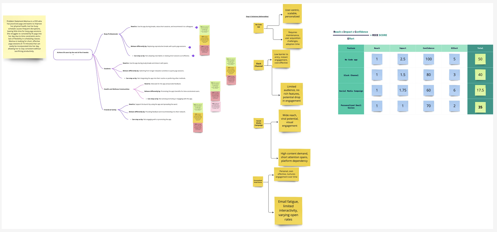

## StriveWell-The-Yoga-Consistency-App-for-Busy-Professionals

## Problem Statement
Marissa, a CEO committed to improving her physical health, struggles to consistently fit yoga into her hectic schedule. She seeks short, effective yoga sessions (5-15 minutes) that can seamlessly integrate into her busy day, allowing her to maintain consistency without disrupting productivity.

## Objective
Launch the first version of the wellness app within 8 weeks, focusing on user engagement and gathering valuable community feedback.

## Key Results
User Acquisition: Achieve 50 users by the end of the 8 weeks.
Feedback Collection: Gather feedback from at least 10 users.
Community Engagement: Share the app within 3 relevant communities.

## Links:
Trello Board:https://trello.com/b/4UHDl2JQ/strivewell-the-yoga-consistency-app-for-busy-professionals

Impact Mapping and RICE framework:

